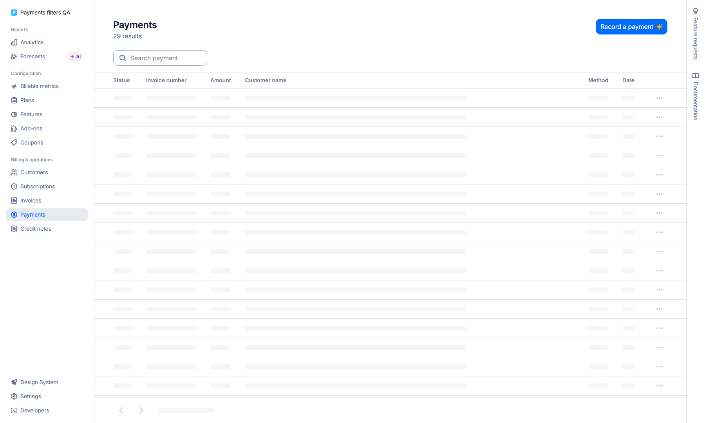
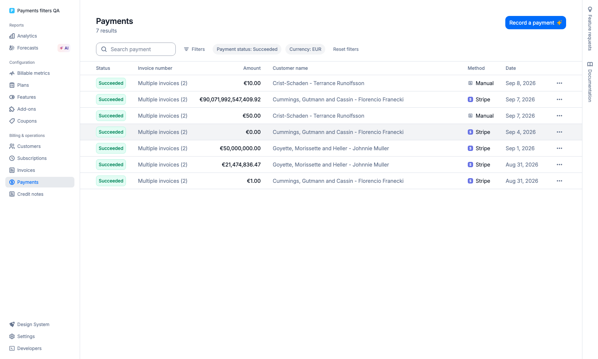
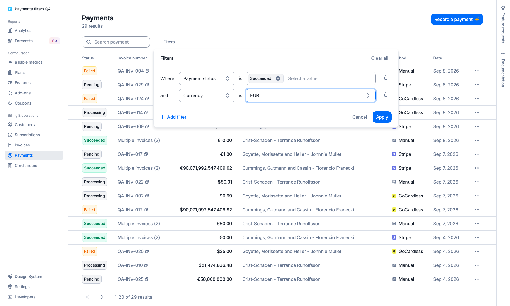

# Payments filters QA

Run on 2026-09-07 against the local API and front, with the reproducible
`lago-api/script/seed_payments_filters.rb` fixtures (30 payments, 29 visible).
Only `/payments` was exercised in the UI after signing in to the disposable organization.

47 automated browser checks passed. Each checks the GraphQL response status,
variables, count and payment IDs against the seed manifest, the rendered table IDs,
and an identical REST request. Each UI change sends one `getPaymentsList` request.
Every filter was applied from the panel and persisted after reload. Pagination resets
to page 1 when filters change. No export action is present.

| Scenario                                | Matching payments |
| --------------------------------------- | ----------------: |
| baseline                                |                29 |
| Payment status                          |                14 |
| Payment provider                        |                10 |
| Payment method                          |                 5 |
| Currency                                |                15 |
| Receipt number                          |                 1 |
| Invoice number                          |                 1 |
| Payment type                            |                10 |
| Payable type                            |                 7 |
| Customer                                |                10 |
| Date                                    |                17 |
| Amount Is at least 50000000             |                 8 |
| Amount Is up to 50                      |                15 |
| Amount Is between 50                    |                 6 |
| Amount Is equal to 90071992547409.93    |                 2 |
| Amount Is equal to 92233720368547758.07 |                 2 |
| page 2                                  |                29 |
| three filters reset page 1              |                 5 |
| three filters plus search               |                 5 |
| clear search                            |                 5 |

The recording demonstrates selecting payment status and currency, applying,
reloading and clearing them. The `succeeded` + `EUR` predicate returns 7 payments;
`cli-comparison-ui.json` records the exact IDs for the CLI cross-check.
`ui-qa.json` contains the complete request/count/ID evidence without credentials.

[Screen recording](payments-filters.webm)

Validation: 710 filter/page regression tests, then 241 targeted tests after the
selected-option label refinement; TypeScript, ESLint and translation inspection /
consistency checks pass. Changed executable line coverage is 124/127 (97.64%).
The generated GraphQL document is tested to declare both amount variables as BigInt.

Compatibility notes:

- The existing GraphQL `PaymentMethodTypeEnum` already names manual/provider, so the
  API adds `PaymentProviderMethodTypeEnum` for provider method options.
- Exact decimal handling is enabled only for the payments amount input and adapter;
  invoice and credit-note filters keep their existing behavior.
- The existing table formats very large displayed amounts through JavaScript Number,
  and can round their display; filter inputs, URLs and request bounds retain every digit.
- The existing visible-invoice statuses include draft. This feature preserves that
  visibility rule; the seed's open-invoice payment stays hidden.
- Bullet reports existing lazy payment associations on unfiltered and filtered list
  requests. The payment fragment and list component are unchanged by this feature.
